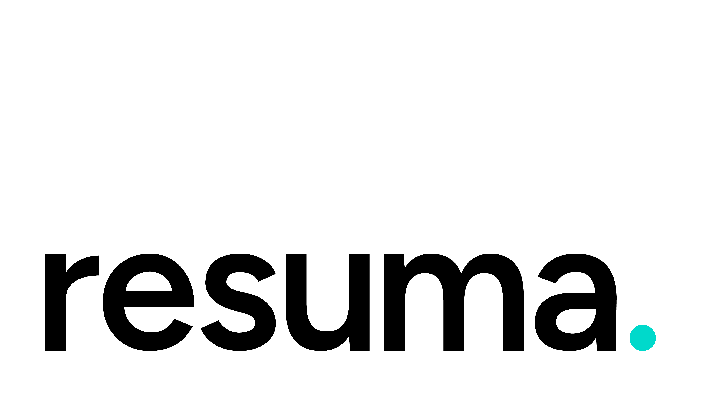

# 


Resuma is an open-source desktop application for building beautiful, professional resumes using local AI models. Your data never leaves your device.

Powered by Tauri, Rust, React (TSX), and llama.cpp, Resuma brings the power of private AI directly to your desktop, ensuring fast performance and complete privacy.

> ⚡ **Offline and private**: No external servers, complete control over your data.

> ⚡ **Cross-platform**: Works on Windows, macOS, and Linux.

## 🔧 Features

- ✍️ Offline AI resume writing
- 📂 Full local data storage (no external servers)
- ✨ Elegant onboarding and user experience
- ⚙️ Advanced model configuration (mmap, mlock, gpu_layers, context size, etc.)
- 👨‍💼 Customizable personal information, education, projects, skills, and more

## 📦 Installation

### Option 1: Official Installer (Recommended)

Visit [resuma.download](https://resuma.download) or the [GitHub Releases page](https://github.com/nikolchaa/resuma/releases) to download the latest stable version.

### Option 2: Bleeding Edge (Development Builds)

Clone and run the latest development version directly from GitHub:

```bash
git clone https://github.com/nikolchaa/resuma.git
cd resuma
npm install
npm run tauri dev
```

> **Note:** Development builds may contain experimental features. Make sure you have Rust and Tauri prerequisites installed. See the [Tauri setup guide](https://v2.tauri.app/start/prerequisites/).

## 🔒 License

This project is licensed under the [Apache 2.0 License](./LICENSE).

"Resuma™" and the Resuma™ logo are trademarks of Nikola Ranđelović. Please see the [Trademark Policy](./TRADEMARK.md) for details.

## 📧 Contact

Questions, ideas, or contributions? Reach out to us at [contact@nikolchaa.com](mailto:contact@nikolchaa.com).

---

Craft resumes the right way. Own your data. Build your future. ✨
